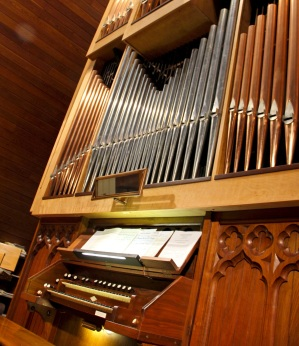

!SLIDE
# Antonín Dvořák
### By: Robert Clark

!SLIDE bullets incremental left transition=fade
## Early Life

* Born September 8, 1841, in Nelahozeves, a previously Bohemian village
* 
* His father was an amateur musician.
* He played violin in his father's inn often during his early life.
* Was encouraged by his mother and father along the way.

.notes Nelahozeves is now a Czech Village
.notes He would play violin with other performers while local couples danced.

!SLIDE bullets incremental transition=fadeZoom
## Prague Organ School ##
* 

* At the age of 16, it was suggested by a music teacher that Dvořák enroll in organ school in Prague.
* His family was supportive and his father helped him to enroll.
* He completed his 2 years at the school, finishing without financial support from his father.
* During his time he provided private piano lessons.
* One of his students during this time later became his wife.
!SLIDE
# References

[Encyclopedia Britannica](http://www.britannica.com/EBchecked/topic/174804/Antonin-Dvorak)  
[Classical.net](http://www.classical.net/music/comp.lst/dvorak.php)  
