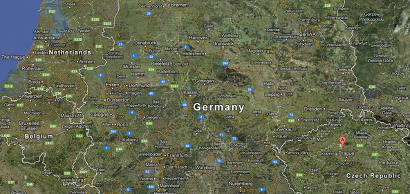

!SLIDE
# Antonín Dvořák
### By: Robert Clark

!SLIDE bullets incremental left transition=fade
## Early Life

* Born September 8, 1841, in Nelahozeves, a previously Bohemian village
* 
* His father was an amateur musician.
* He played violin in his father's inn often during his early life.
* Was encouraged by his mother and father along the way.

.notes Nelahozeves is now a Czech Village
.notes He would play violin with other performers while local couples danced.

!SLIDE bullets incremental transition=fadeZoom
## Prague Organ School
* 

* At the age of 16, it was suggested by a music teacher that Dvořák enroll in organ school in Prague.
* His family was supportive and his father helped him to enroll.
* He completed his 2 years at the school, finishing without financial support from his father.
* During his time he provided private piano lessons.
* One of his students during this time later became his wife.

!SLIDE bullets incremental transition=toss
## Life after School
* 

* During the 1860's, Dvořák played viola in the Bohemian Provisional Theatre Orchestra.
* During this time he was hard pressed for time to compose.
* He later claimed to have very little memory of the 1860s.
* Even though he was quite busy, he still managed to compose.

.notes He wrote two syphonies, an opera, chamber music, and numerous other songs during this time.

!SLIDE transition=turnDown
## The Bells of Zlonice

<iframe width="560" height="315" src="http://www.youtube.com/embed/RxnBzRpqhZU#t=01s" frameborder="0" allowfullscreen></iframe>

.notes This was his first symphony which he originally believed was lost.

!SLIDE bullets incremental transition=zoom
## Financial Assistance
* 

* In 1874, the year after he married his wife and former student, Anna, Dvořák applied and received a state grant from the Austrian Government.
* The grant also brought him the attention of Johannes Brahms.
* The grant eased his financial burden, and the attention of Johannes Brahms, who persuaded his publisher to bring on Dvořák.
* He also became good friends with Johannes Brahms in the process.

!SLIDE bullets incremental transition=growX
## A composer + a Professor
* 

* In 1889, Dvořák was hired as a professor at the Prague conservatory.
* He would only allow students with a polished technique into his class.
* He also insisted that his students "find their own way".
* His star pupil was his son-in-law, Josef Suk.

!SLIDE bullets incremental transition=shuffle
## Promotion!
* 

* In 1892, Dvořák was offered the position of Director of the National Conservatory in NYC.
* He accepted, and moved his wife and six children to America.
* During this time he was commissioned to write his 9th symphony called "From the New World".
* He called it his 5th in order to avoid superstition, but it was still the last syphony he wrote.
* After much homesickness he decided to move away from America in 1895.

.notes He was expected to pave the way for an "American" music style with his works in America.
.notes His new position paid $15,000 dollars a year.

!SLIDE bullets incremental transition=turnDown
## Final Years
* 

* After his return from the US, Dvořák did his best to keep his return quiet.
* He became the director of the Prague Conservatory after his return.
* He held his position as director until his death.
* On May 1st, 1904, Dvořák died of a stroke at the age of 63.
* His death caused many of his works to go unfinished.
!SLIDE transition=fade
## Notable Pieces

<iframe width="560" height="420" src="http://www.youtube.com/embed/H2amTjF_mkM#t=08s" frameborder="0" allowfullscreen></iframe>

.notes Used on Star Trek TNG
!SLIDE transition=fade
## Symphony #9

<iframe width="560" height="420" src="http://www.youtube.com/embed/UNR_AZL9XAw#t=1m04s" frameborder="0" allowfullscreen></iframe>

!SLIDE transition=zoom
# References

[Encyclopedia Britannica](http://www.britannica.com/EBchecked/topic/174804/Antonin-Dvorak)  
[Classical.net](http://www.classical.net/music/comp.lst/dvorak.php)  
[8notes.com](http://www.8notes.com/biographies/dvorak.asp)  

### Presentation Software

[Showoff](https://github.com/schacon/showoff)
